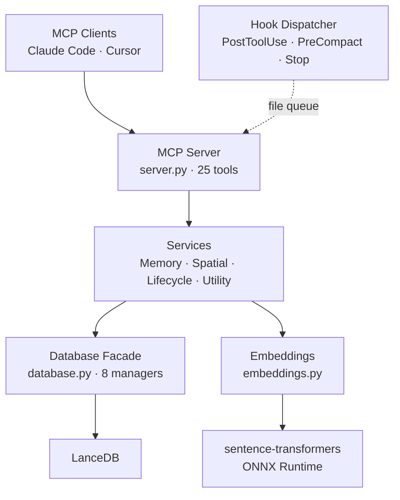

# Spatial Memory MCP Server

[](https://pypi.org/project/spatial-memory-mcp/)
[](https://www.python.org/downloads/)
[](https://opensource.org/licenses/MIT)

A persistent semantic memory system for LLMs via the [Model Context Protocol](https://modelcontextprotocol.io/) that treats knowledge as a navigable landscape, not a filing cabinet.

> **Version 1.11.4** — Production-ready with 2,500+ tests across Windows, macOS, and Linux.

**Your AI assistant forgets everything between sessions. Spatial Memory fixes that.** It gives Claude Code, Cursor, and any MCP client a persistent brain — memories that fade when stale, sharpen with use, and organize themselves into a navigable knowledge graph. Install in one command, capture knowledge automatically, and let your AI build on what it learned yesterday.

## Why Spatial Memory?

Most memory servers store and retrieve. Spatial Memory **thinks** about your knowledge.

### Memories That Fade Like Yours Do

Other memory tools treat every piece of information as equally important forever. Spatial Memory applies **time-based decay** — old, unused memories gradually lose importance while frequently accessed knowledge stays sharp. The result: your AI assistant surfaces what's relevant *now*, not what was relevant six months ago. Decay is automatic and configurable — adjust half-life, decay curves (exponential, linear, step), and minimum importance floors. Memories accessed frequently decay slower, just like human recall.

**Why this approach?** The cognitive memory model is inspired by established research:

- **[Ebbinghaus, H. (1885)](https://psychclassics.yorku.ca/Ebbinghaus/index.htm)** — *Memory: A Contribution to Experimental Psychology*. The foundational research on the forgetting curve showing how memory retention decays exponentially over time. Our exponential decay function directly models this curve.
- **[Settles, B. & Meeder, B. (2016)](https://aclanthology.org/P16-1174/)** — *A Trainable Spaced Repetition Model for Language Learning*. Duolingo's half-life regression (HLR) algorithm for optimizing memory retention. Our configurable half-life and access-count weighting draw from this work.
- **[FSRS Algorithm](https://github.com/open-spaced-repetition/fsrs4anki)** — Free Spaced Repetition Scheduler. A modern open-source algorithm for optimizing review intervals based on memory research. Informed our adaptive decay that slows for frequently accessed memories.

### Zero-Effort Memory Capture

You shouldn't have to stop coding to tell your AI "remember this." With **cognitive offloading**, hook scripts run silently in the background and capture decisions, bug fixes, error root causes, and architecture choices *as they happen* — no manual `remember` calls needed.

- **PostToolUse** — captures insights after each tool call
- **PreCompact** — saves knowledge before context window compaction would erase it
- **Stop** — grabs remaining valuable context at session end

Content is classified into tiers (auto-save, ask-first, skip) and secrets are automatically redacted before storage.

### Navigate and Search Like No Other Memory Server

Traditional memory is a search box. Spatial Memory is a **map with a search engine**. You get **hybrid search** — combined vector similarity *and* keyword matching with a tunable alpha — plus spatial tools that let you explore the space *between* and *around* your memories:

| Tool | What It Does |
|------|-------------|
| `hybrid_recall` | Combined vector + keyword search with tunable balance (alpha 0.0-1.0) — find memories that match both meaning *and* specific terms |
| `journey` | Walk the conceptual path between two memories using SLERP interpolation — discover what lies in between "authentication" and "performance" |
| `wander` | Take a temperature-controlled random walk — stumble into unexpected connections you'd never think to search for |
| `regions` | See how your knowledge self-organizes into clusters via HDBSCAN — find the natural shape of what you know |
| `visualize` | Project your memory space into 2D/3D via UMAP — render as JSON, Mermaid diagrams, or SVG |

### Fast and Lightweight Embeddings

No GPU. No heavy model downloads. Spatial Memory defaults to **[all-MiniLM-L6-v2](https://huggingface.co/sentence-transformers/all-MiniLM-L6-v2)** — an ~80MB model trained on over 1 billion sentence pairs that maps text to 384-dimensional vectors, accelerated by **ONNX Runtime** for 2-3x faster inference over the default PyTorch backend — all on CPU alone.

- **ONNX Runtime** auto-detected at startup — no configuration needed
- **CPU-only** — no CUDA, no GPU drivers, works everywhere Python runs

---

## How Is This Different?

Most MCP memory servers are vector stores with semantic recall — store text, search by similarity, retrieve results. Spatial Memory starts there but adds what they don't: **time-based decay** that fades stale knowledge automatically, **cognitive offloading hooks** that capture decisions and errors without manual calls, **spatial navigation** (SLERP interpolation, random walks, HDBSCAN clustering) for exploring the space *between* memories, and **hybrid search** that combines vector similarity with keyword matching. If you need a simple key-value memory, any of those will work. If you want memory that behaves more like human recall — fading, reinforcing, and organizing itself — this is the one.

## Quick Start

### Claude Code (Recommended)

**Option A — Plugin (zero-config):**

```bash
claude plugin marketplace add arman-tech/spatial-memory-mcp
claude plugin install spatial-memory@spatial-memory-marketplace
```

This installs the plugin globally (user scope) — available across all your projects. To install for the current project only:

```bash
cd /path/to/your/project
claude plugin install spatial-memory@spatial-memory-marketplace --scope project
```

That's it. The plugin registers 3 hooks (PostToolUse, PreCompact, Stop), starts the MCP server, and begins capturing knowledge automatically as you work.

**Option B — Manual MCP config:**

Add to your Claude Code settings (`~/.claude/settings.json` or project `.claude/settings.json`):

```json
{
  "mcpServers": {
    "spatial-memory": {
      "command": "uvx",
      "args": ["--from", "spatial-memory-mcp", "spatial-memory", "serve"],
      "env": {
        "SPATIAL_MEMORY_COGNITIVE_OFFLOADING_ENABLED": "true"
      }
    }
  }
}
```

No `pip install` needed — `uvx` fetches the package from PyPI automatically.

### Cursor

From your project root, one command writes `.cursor/mcp.json`, `.cursor/hooks.json`, and `.cursor/rules/spatial-memory.mdc`:

```bash
pip install spatial-memory-mcp
cd /path/to/your/project
spatial-memory init --client cursor
```

### Claude Desktop / Other MCP Clients

Add to your MCP client config (e.g., `claude_desktop_config.json`):

```json
{
  "mcpServers": {
    "spatial-memory": {
      "command": "uvx",
      "args": ["--from", "spatial-memory-mcp", "spatial-memory", "serve"],
      "env": {
        "SPATIAL_MEMORY_COGNITIVE_OFFLOADING_ENABLED": "true"
      }
    }
  }
}
```

No `pip install` needed — `uvx` fetches the package from PyPI automatically.

| Client | Install | Hooks | Notes |
|--------|---------|-------|-------|
| Claude Code | Plugin or pip | Native (auto) | Full auto-capture via plugin or manual settings |
| Cursor | pip + `init` | Native (auto) | One-command setup via `spatial-memory init --client cursor` |
| Claude Desktop | pip | Manual | Add MCP config, hooks require manual setup |
| Other MCP clients | pip | Manual | Any client that speaks MCP works |

## How It Works

### Cognitive Offloading (Auto-Capture)

Three hooks (PostToolUse, PreCompact, Stop) run silently in the background to capture knowledge as you work — see [Why Spatial Memory?](#zero-effort-memory-capture) for the full description. Captured content is classified into tiers:

| Tier | Behavior | What's Captured |
|------|----------|-----------------|
| **1** | Auto-save | Decisions, bug fixes, error root causes, architecture choices |
| **2** | Ask first | Patterns, preferences, configuration discoveries, workarounds |
| **3** | Skip | Trivial observations, duplicates, speculative information |

Secrets (API keys, tokens, passwords) are automatically redacted before storage.

### 25 MCP Tools

| Category | Tools |
|----------|-------|
| **Core** | `remember`, `remember_batch`, `recall`, `nearby`, `forget`, `forget_batch` |
| **Spatial** | `journey`, `wander`, `regions`, `visualize` |
| **Lifecycle** | `decay`, `reinforce`, `extract`, `consolidate` |
| **Utility** | `stats`, `namespaces`, `delete_namespace`, `rename_namespace`, `export_memories`, `import_memories`, `hybrid_recall`, `health` |
| **Cross-corpus** | `discover_connections`, `corpus_bridges` |
| **Setup** | `setup_hooks` |

See [docs/API.md](docs/API.md) for complete parameter and return type documentation.

## Configuration

Settings via environment variables or `.env` file. Key options:

| Variable | Default | Description |
|----------|---------|-------------|
| `SPATIAL_MEMORY_MEMORY_PATH` | `./.spatial-memory` | LanceDB storage directory |
| `SPATIAL_MEMORY_EMBEDDING_MODEL` | `all-MiniLM-L6-v2` | Embedding model (or `openai:text-embedding-3-small`) |
| `SPATIAL_MEMORY_EMBEDDING_BACKEND` | `auto` | `auto` (ONNX if available), `onnx`, or `pytorch` |
| `SPATIAL_MEMORY_OPENAI_API_KEY` | — | Required only for OpenAI embeddings |
| `SPATIAL_MEMORY_COGNITIVE_OFFLOADING_ENABLED` | `false` | Enable queue-based auto-capture pipeline |
| `SPATIAL_MEMORY_AUTO_DECAY_ENABLED` | `true` | Automatic importance decay over time |
| `SPATIAL_MEMORY_LOG_LEVEL` | `INFO` | Logging verbosity |

See [docs/CONFIGURATION.md](docs/CONFIGURATION.md) for the full reference including auto-decay tuning, rate limiting, and connection pool settings.

## CLI Commands

```bash
# Server
spatial-memory serve                     # Start the MCP server (default)

# Setup
spatial-memory init --client cursor      # Auto-configure Cursor (writes 3 files)
spatial-memory setup-hooks --client X    # Generate hook config for Claude Code or Cursor

# Database maintenance
spatial-memory namespaces                # List all namespaces with memory counts
spatial-memory consolidate <namespace>   # Merge duplicate memories (dry run by default)
spatial-memory consolidate <ns> --no-dry-run  # Actually apply merges
spatial-memory migrate --status          # Check database migration status

# Utilities
spatial-memory hook <event> --client X   # Run a hook event (used by hook configs)
spatial-memory instructions              # View auto-injected MCP instructions
spatial-memory --version                 # Show version
```

## Security

- **Path traversal prevention** on all file operations
- **SQL injection detection** (13 patterns)
- **Secret redaction** in cognitive offloading (AWS, GitHub, Stripe, OpenAI, SSH keys, JWTs, etc.)
- **Input validation** via Pydantic models on all tool inputs
- **Error sanitization** — internal errors return reference IDs, not stack traces
- **Secure credentials** — API keys stored as `SecretStr`

## Development

```bash
# Install from source
git clone https://github.com/arman-tech/spatial-memory-mcp.git
cd spatial-memory-mcp
pip install -e ".[dev]"

# Run tests
pytest tests/ -v              # Unit tests only
pytest tests/ -v -m ""        # All tests (unit + integration)

# Quality checks
ruff check spatial_memory/ tests/
ruff format --check spatial_memory/ tests/
mypy spatial_memory/
```

## Architecture

Clean Architecture with ports/adapters pattern:



```
spatial_memory/
├── server.py       # MCP server + tool handlers
├── factory.py      # Dependency injection container
├── config.py       # Pydantic settings
├── core/           # Database, embeddings, models, validation, security
├── services/       # Business logic (memory, spatial, lifecycle, utility)
├── adapters/       # LanceDB repository, project detection, git utils
├── ports/          # Protocol interfaces
├── hooks/          # Cognitive offloading dispatcher + pipeline
├── tools/          # MCP tool definitions + setup_hooks generator
└── migrations/     # Database schema migrations
```

See [SPATIAL-MEMORY-ARCHITECTURE-DIAGRAMS.md](SPATIAL-MEMORY-ARCHITECTURE-DIAGRAMS.md) for visual documentation.

## Documentation

| Document | Description |
|----------|-------------|
| [docs/API.md](docs/API.md) | Complete API reference for all 25 tools |
| [docs/CONFIGURATION.md](docs/CONFIGURATION.md) | Full configuration reference |
| [docs/GETTING_STARTED.md](docs/GETTING_STARTED.md) | Step-by-step tutorial |
| [docs/TECHNICAL_HIGHLIGHTS.md](docs/TECHNICAL_HIGHLIGHTS.md) | Algorithm deep-dives (SLERP, HDBSCAN, UMAP) |
| [docs/BENCHMARKS.md](docs/BENCHMARKS.md) | Performance benchmarks |
| [docs/troubleshooting.md](docs/troubleshooting.md) | Common issues and solutions |

## Supported Platforms

- **Windows 11**, **macOS** (latest), **Linux** (Fedora, Ubuntu, Linux Mint)
- Python 3.10+
- CI tested across 3 OS x 4 Python versions

## Contributing

1. Fork the repository
2. Create a feature branch
3. Add tests for new functionality
4. Ensure all tests pass (`pytest tests/ -v -m ""`)
5. Submit a pull request

For contributors using AI assistants, see [CLAUDE.md](CLAUDE.md) for project-specific guidance.

## License

MIT — See [LICENSE](LICENSE)
