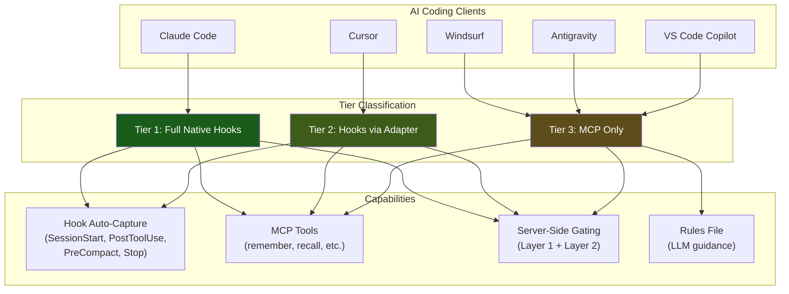
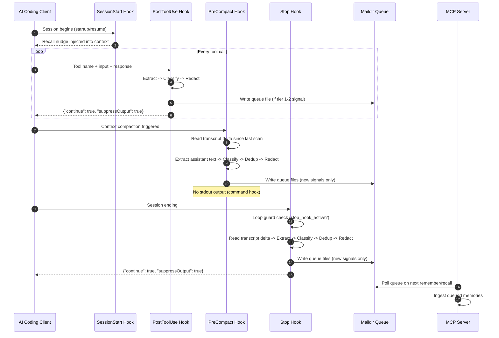
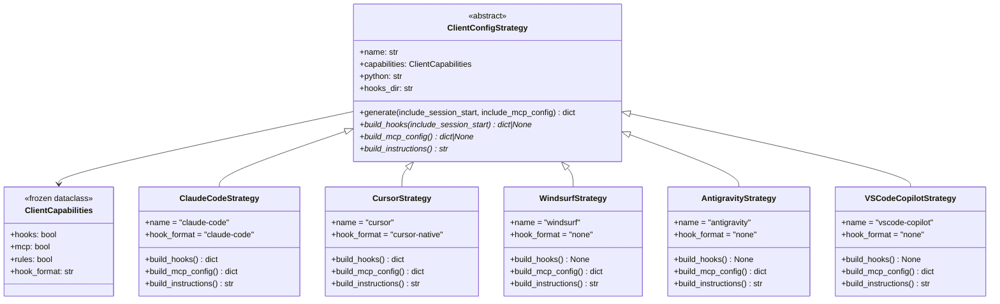
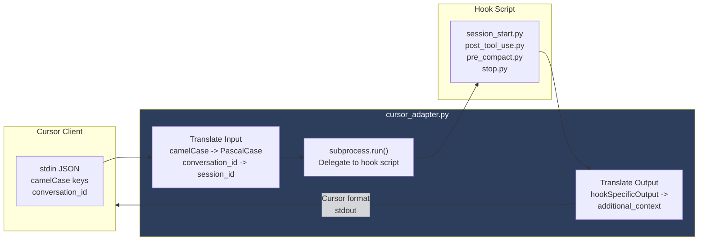
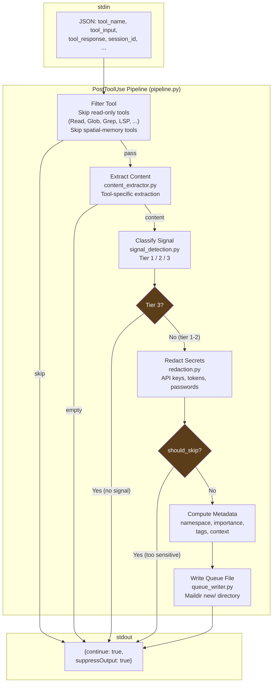
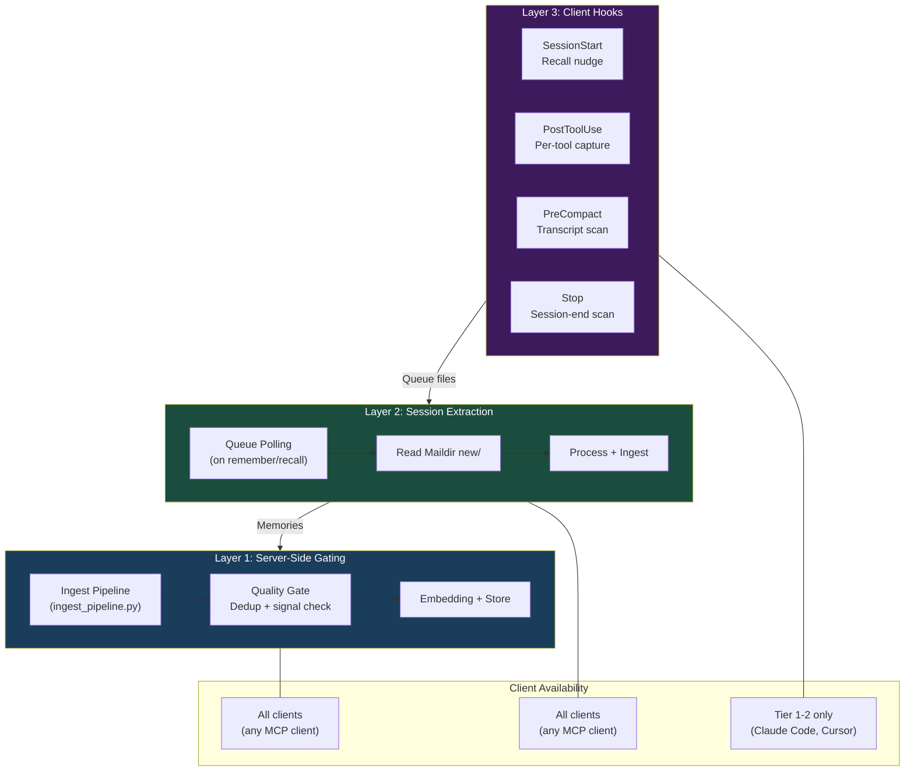

# Hooks Architecture

Internal architecture reference for the cognitive offloading hook system. For installation instructions, see [CLIENT_SETUP_GUIDE.md](CLIENT_SETUP_GUIDE.md).

---

## 1. Three-Tier Client Overview

Clients are classified into three tiers based on their hook support. All tiers get MCP tools and server-side processing (Layers 1-2). Only Tiers 1-2 get auto-capture hooks (Layer 3).



---

## 2. Hook Lifecycle

A typical session fires hooks in this order. PostToolUse fires many times (one per tool call). PreCompact fires before context compaction. Stop fires once at session end.



---

## 3. Strategy Pattern (Client Config Generation)

The `setup_hooks` tool uses Strategy + Template Method to generate correct configuration for each client. The `generate()` template method calls three abstract hooks that each strategy implements.



### Registry and Alias Resolution

```python
_STRATEGY_REGISTRY = {
    "claude-code": ClaudeCodeStrategy,
    "cursor":      CursorStrategy,
    "windsurf":    WindsurfStrategy,
    "antigravity": AntigravityStrategy,
    "vscode-copilot": VSCodeCopilotStrategy,
}

_CLIENT_ALIASES = {
    "claude": "claude-code",  "claudecode": "claude-code",
    "gemini": "antigravity",
    "copilot": "vscode-copilot",  "vscode": "vscode-copilot",  "vs-code": "vscode-copilot",
}
```

The public `generate_hook_config()` facade resolves aliases, instantiates the strategy, and calls `generate()`.

---

## 4. Cursor Adapter Flow

Cursor uses camelCase hook events and `conversation_id` instead of Claude Code's PascalCase events and `session_id`. The adapter script translates in both directions.



### Translation Details

| Field | Cursor Format | Claude Code Format |
|-------|--------------|-------------------|
| Session ID | `conversation_id` | `session_id` |
| Event names | `sessionStart`, `postToolUse`, `preCompact`, `stop` | `SessionStart`, `PostToolUse`, `PreCompact`, `Stop` |
| SessionStart output | `{"additional_context": "...", "continue": true}` | `{"hookSpecificOutput": {"hookEventName": "SessionStart", "additionalContext": "..."}}` |
| Source field | Not provided (synthesized as `"startup"`) | `"startup"` or `"resume"` |

---

## 5. Hook Script Pipeline (PostToolUse)

The PostToolUse pipeline processes each tool call through a series of gates. Any gate can skip the rest of the pipeline.



### Signal Tiers

| Tier | Meaning | Action | Example Patterns |
|------|---------|--------|-----------------|
| 1 | Strong signal (score >= 0.8) | Queue (importance floor 0.7) | `decision`, `important`, `solution`, `error`, `explicit`, `pattern` |
| 2 | Moderate signal (score 0.5-0.79) | Queue (importance floor 0.4) | `definition`, `convention`, `workaround`, `configuration` |
| 3 | No signal | Skip (not memory-worthy) | Routine output, status messages |

### Transcript Pipeline (PreCompact / Stop)

PreCompact and Stop use a parallel pipeline (`transcript_pipeline.py`) that:

1. **Reads transcript delta** — JSONL reader with byte-offset tracking (only reads new entries since last scan)
2. **Extracts assistant text** — Filters for `assistant` role entries with non-empty content blocks
3. **Deduplicates against PostToolUse** — SHA-256 hash comparison against existing queue files to avoid double-capture
4. **Classifies + Redacts + Writes** — Same signal/redaction/queue chain as PostToolUse

---

## 6. Cognitive Offloading Layers

The three-layer architecture ensures memory capture even when hooks are unavailable. Each layer is independent.



### Layer Details

| Layer | Where | Trigger | What It Does |
|-------|-------|---------|-------------|
| **Layer 1** | MCP server | Every `remember` call | Quality gate, dedup, embedding, storage |
| **Layer 2** | MCP server | Every `remember`/`recall` | Polls Maildir queue, ingests queued items via Layer 1 |
| **Layer 3** | Client hooks | Session lifecycle events | Extracts signals from tool calls and transcripts, writes to Maildir queue |

---

## File Reference

### Hook Scripts (Entrypoints)

| File | Event | Description |
|------|-------|-------------|
| `hooks/session_start.py` | SessionStart | Outputs recall nudge as `additionalContext`. Fires on `startup`/`resume` only. Minimal: json + sys only. |
| `hooks/post_tool_use.py` | PostToolUse | Processes each tool call through extract/classify/redact/queue pipeline. Async in Claude Code. |
| `hooks/pre_compact.py` | PreCompact | Scans transcript delta for assistant text missed by PostToolUse. No stdout output. |
| `hooks/stop.py` | Stop | Same as PreCompact but with loop guard (`stop_hook_active` check). Sets `trigger="session_end"`. |
| `hooks/cursor_adapter.py` | All events | Translates Cursor format to/from Claude Code format, delegates via subprocess. |

### Hook Modules (Shared Logic)

| File | Purpose |
|------|---------|
| `hooks/models.py` | Data types: `HookInput`, `TranscriptHookInput`, `ProcessingResult`, `TranscriptEntry`. Tool filtering constants and `should_skip_tool()`. |
| `hooks/hook_helpers.py` | Shared utilities: `read_stdin()`, `write_stdout_response()`, `sanitize_session_id()`, `validate_transcript_path()`, `get_project_root()`. |
| `hooks/pipeline.py` | PostToolUse orchestrator: `run_pipeline()`. Also exports `score_to_importance()` and `derive_namespace()`. |
| `hooks/content_extractor.py` | Extracts memory-worthy content from tool name/input/response. |
| `hooks/signal_detection.py` | Pattern-based signal classifier. Returns tier (1-3), score, and matched patterns. |
| `hooks/redaction.py` | Regex-based secret redaction (API keys, tokens, passwords). Returns redacted text and `should_skip` flag. |
| `hooks/queue_writer.py` | Writes JSON files to Maildir `new/` directory. Provides `get_queue_dir()`. |
| `hooks/transcript_reader.py` | JSONL delta reader with byte-offset state persistence. `read_transcript_delta()` + `load_state()`/`save_state()`. |
| `hooks/transcript_extractor.py` | Filters transcript entries for assistant role with non-empty text. |
| `hooks/overlap_detector.py` | SHA-256 dedup against existing PostToolUse queue files. `get_queued_hashes()` + `is_duplicate()`. |
| `hooks/transcript_pipeline.py` | PreCompact/Stop orchestrator: `run_transcript_pipeline()`. |

### Config Generation

| File | Purpose |
|------|---------|
| `tools/setup_hooks.py` | Strategy pattern: `ClientConfigStrategy` ABC, 5 concrete strategies, registry, alias resolution, `generate_hook_config()` facade. |
| `server.py` | `_handle_setup_hooks` — MCP tool handler for `setup_hooks`. |
| `__main__.py` | `setup-hooks` CLI subcommand. |

### Plugin

| File | Purpose |
|------|---------|
| `plugin/.claude-plugin/plugin.json` | Plugin manifest (name, version, author). |
| `plugin/hooks/hooks.json` | Claude Code hook event config — PostToolUse, PreCompact, Stop (SessionStart excluded, see below). |
| `plugin/hooks/*.py` | Copies of hook scripts (synced by `scripts/sync_plugin_hooks.py`). |
| `plugin/scripts/find_python.sh` | Python interpreter resolver for Unix/macOS plugin hooks. |
| `plugin/scripts/find_python.cmd` | Python interpreter resolver for Windows plugin hooks. |

---

## Design Decisions

### Why subprocess for the Cursor adapter?

The adapter delegates to hook scripts via `subprocess.run()` rather than importing them directly. This keeps the adapter **stdlib-only** with no dependency on the `spatial_memory` package at import time. The hook scripts themselves load sibling modules via `importlib.util.spec_from_file_location()` to bypass `spatial_memory/__init__.py`, which pulls in heavy dependencies (lancedb, numpy, sentence-transformers).

### Why stdlib-only hook scripts?

Hook scripts run on every tool call (PostToolUse) or at critical session boundaries. They must:

- Start fast (< 100ms overhead)
- Never fail in a way that blocks the user
- Work when installed as standalone files in the plugin directory

Using only stdlib imports avoids import-time latency from heavy packages and ensures the scripts work in the plugin context where only the `hooks/` directory is available, not the full `spatial_memory` package.

### Why fail-open?

All hook scripts catch all exceptions and exit 0. A hook failure should never:

- Block the user's session
- Produce error output that confuses the LLM
- Cause the client to disable hooks

The cost of a missed memory capture is low (the LLM can still call `remember` manually). The cost of a broken session is high.

### Why Maildir queue instead of direct API calls?

Hook scripts cannot call the MCP server's `remember` tool directly (the server runs in a separate process, and hooks are invoked by the client, not the server). The Maildir-style queue (`new/` directory with atomic file writes) provides:

- **Decoupling**: Hooks write, server reads — no bidirectional communication needed
- **Reliability**: Filesystem writes are atomic (write to temp, rename to `new/`)
- **No dependencies**: Works with stdlib `pathlib` and `json`
- **Idempotency**: Server processes each file once and moves it out of `new/`

### Why loop guard on Stop hook?

The Stop hook emits `{"continue": true}` so Claude processes normally. Without the loop guard, this could create an infinite loop: Stop fires -> emits continue -> Claude stops again -> Stop fires again. The `stop_hook_active` field in stdin tells the hook that it's already been invoked for this stop sequence.

---

## Known Limitations

### Windows: Plugin SessionStart hooks freeze terminal input

**Affected**: Claude Code v2.1.37 on Windows with `--plugin-dir` plugins.

Any SessionStart hook registered via a plugin's `hooks.json` causes the terminal input to freeze on Windows. This is not specific to our scripts — even `cmd /c echo {}` triggers the freeze. Other hook events (PostToolUse, PreCompact, Stop) work correctly from plugins.

**Workaround**: SessionStart is excluded from the plugin's `hooks.json`. Users who want the recall nudge can install it via `.claude/settings.json` using the `setup-hooks` CLI:

```bash
python -m spatial_memory setup-hooks --client claude-code
```

Settings-based hooks do not have this limitation.

**Status**: Upstream bug. SessionStart will be re-added to the plugin once fixed.

### Windows: Shell scripts require Git Bash

The `find_python.sh` script requires Git Bash on Windows. The plugin's `hooks.json` uses `python` directly instead of the shell wrapper to avoid this dependency. A `find_python.cmd` is provided for Windows-native environments.

---

## Related Documents

- [CLIENT_SETUP_GUIDE.md](CLIENT_SETUP_GUIDE.md) — End-user installation per client
- [COGNITIVE_OFFLOADING_DESIGN.md](COGNITIVE_OFFLOADING_DESIGN.md) — Full design document with research
- [HOOK_BENCHMARK_RESULTS.md](HOOK_BENCHMARK_RESULTS.md) — Performance measurements
- [../SPATIAL-MEMORY-ARCHITECTURE-DIAGRAMS.md](../SPATIAL-MEMORY-ARCHITECTURE-DIAGRAMS.md) — Core server architecture diagrams
