# Technical Highlights

A deep dive into the key algorithms and design decisions that differentiate Spatial Memory MCP from traditional vector databases.

## Table of Contents

- [Cognitive Memory Model vs Traditional Storage](#cognitive-memory-model-vs-traditional-storage)
- [SLERP: Spherical Linear Interpolation](#slerp-spherical-linear-interpolation)
- [Temperature-Based Random Walks](#temperature-based-random-walks)
- [HDBSCAN Clustering](#hdbscan-clustering)
- [UMAP Projection](#umap-projection)
- [ONNX Runtime Optimization](#onnx-runtime-optimization)
- [scipy Integration](#scipy-integration)
- [References](#references)

---

## Cognitive Memory Model vs Traditional Storage

Traditional vector databases focus on a single question: *"How do we store things so we can find them later?"*

Spatial Memory MCP asks a different question: *"How do we give AI systems memory that works like memory—with forgetting, reinforcement, association, and discovery?"*

### The Difference in Practice

| Aspect | Traditional Vector DB | Spatial Memory MCP |
|--------|----------------------|-------------------|
| Storage model | Static embeddings | Dynamic, evolving memories |
| Retrieval | Query → Results | Query → Results + Exploration |
| Time dimension | None | Decay, reinforcement, access tracking |
| Organization | Manual tagging | Self-organizing clusters |
| Discovery | Only what you search for | Serendipitous connections |

### How It Works at Runtime

When the MCP server runs, it implements a cognitive memory model inspired by established memory research:

1. **Memory Decay** (Ebbinghaus Forgetting Curve): Memories fade over time if not accessed. The system supports exponential, linear, and step decay functions with configurable half-life periods.

2. **Reinforcement Learning**: Every access, retrieval, or reference boosts importance scores. Frequently needed knowledge rises to the surface.

3. **Consolidation**: Similar memories merge intelligently using configurable strategies (keep_newest, keep_oldest, keep_highest_importance, merge_content).

4. **Auto-Extraction**: Pattern matching identifies facts, decisions, and key information from conversation transcripts.

This model is inspired by:
- Ebbinghaus's forgetting curve research (1885)
- Duolingo's half-life regression algorithm
- The FSRS (Free Spaced Repetition Scheduler) algorithm

### Memory Lifecycle Diagram

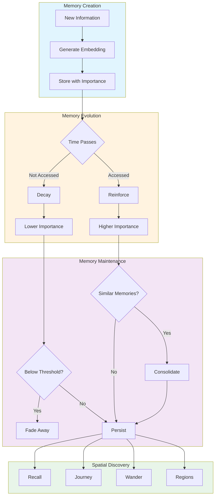

---

## SLERP: Spherical Linear Interpolation

### What It Is

SLERP (Spherical Linear Interpolation) is a method for interpolating between two points on a sphere while maintaining constant angular velocity. In the context of embeddings, it creates a smooth path through semantic space.

### Why It Matters

Embedding vectors are typically normalized to unit length, meaning they all lie on a hypersphere. When navigating between two concepts:

- **Linear interpolation** cuts through the sphere, producing vectors of varying length
- **SLERP** follows the geodesic (great circle) path, maintaining unit length throughout

This makes SLERP geometrically correct for exploring the semantic space between two memories.

### Implementation

The SLERP formula:

```
slerp(v0, v1, t) = sin((1-t)θ) / sin(θ) * v0 + sin(tθ) / sin(θ) * v1
```

Where `θ` is the angle between vectors and `t` is the interpolation parameter (0.0 to 1.0).

From `spatial_memory/core/spatial_ops.py`:

```python
def slerp(v0: Vector, v1: Vector, t: float) -> Vector:
    """
    Spherical linear interpolation between two unit vectors.

    SLERP produces a constant-speed path along the great circle connecting two
    points on the unit sphere. This is more geometrically correct than linear
    interpolation for normalized embedding vectors.
    """
    # Normalize and compute angle
    v0 = normalize(v0.astype(np.float64))
    v1 = normalize(v1.astype(np.float64))
    dot = np.clip(np.dot(v0, v1), -1.0, 1.0)

    # Handle edge cases (parallel/antipodal vectors)
    if dot > 0.9995:  # Nearly parallel - use linear interpolation
        result = v0 + t * (v1 - v0)
        return normalize(result.astype(np.float32))

    # Standard SLERP
    omega = np.arccos(dot)
    sin_omega = np.sin(omega)
    s0 = np.sin((1.0 - t) * omega) / sin_omega
    s1 = np.sin(t * omega) / sin_omega
    return (s0 * v0 + s1 * v1).astype(np.float32)
```

### Use Case: The `journey` Tool

The `journey` tool uses SLERP to navigate between two memories:

1. Generate interpolation points along the SLERP path
2. Find actual memories closest to each interpolation point
3. Return the discovered conceptual path

Example: Journey from "machine learning basics" to "production deployment" might reveal: feature engineering → model validation → containerization → monitoring.

### SLERP vs Linear Interpolation

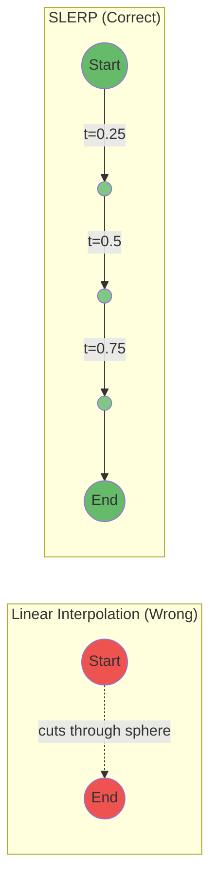

### Journey Tool Flow

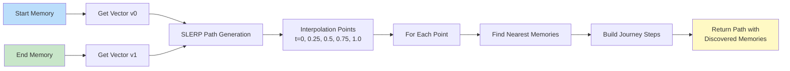

---

## Temperature-Based Random Walks

### What It Is

Temperature-based selection is a technique from reinforcement learning that balances exploration vs exploitation. The `wander` tool uses it for serendipitous discovery through memory space.

### The Temperature Parameter

Temperature controls the randomness of selection:

| Temperature | Behavior |
|-------------|----------|
| 0.0 | Greedy: Always pick the most similar memory |
| 0.5 | Balanced: Mix of focused and exploratory |
| 1.0 | Highly random: Nearly uniform selection |

### Implementation

The softmax function with temperature scaling:

```python
def softmax_with_temperature(scores: NDArray, temperature: float) -> NDArray:
    """
    Temperature controls the randomness of the resulting distribution:
    - T -> 0: Deterministic (all probability mass on highest score)
    - T = 1: Standard softmax
    - T -> inf: Uniform random selection
    """
    if temperature < 1e-10:  # Greedy selection
        result = np.zeros_like(scores)
        result[np.argmax(scores)] = 1.0
        return result

    # Scale by temperature and apply softmax
    scaled = scores / temperature
    scaled_shifted = scaled - np.max(scaled)  # Numerical stability
    exp_scores = np.exp(scaled_shifted)
    return exp_scores / np.sum(exp_scores)
```

### Use Case: The `wander` Tool

Each step of the random walk:

1. Find candidate neighbors from current position
2. Convert similarity scores to selection probabilities using temperature
3. Sample from the probability distribution
4. Move to selected memory, repeat

Lower temperature creates focused, thematic walks. Higher temperature enables unexpected conceptual jumps.

### Wander Algorithm Flow

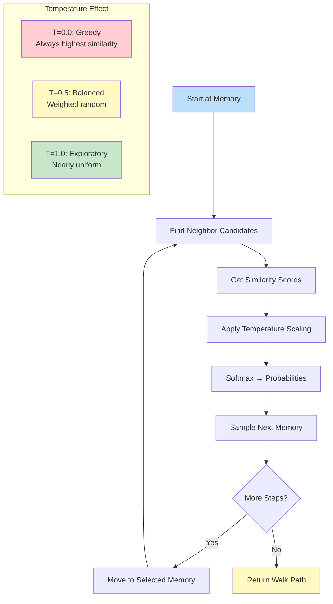

### Temperature Effect on Selection

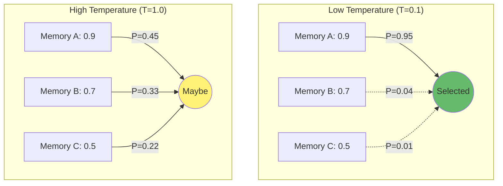

---

## HDBSCAN Clustering

### What It Is

HDBSCAN (Hierarchical Density-Based Spatial Clustering of Applications with Noise) is a clustering algorithm that:

- Automatically determines the number of clusters
- Identifies outliers (noise points)
- Works with varying density clusters
- Requires minimal parameter tuning

### Why HDBSCAN Over K-Means

| Feature | K-Means | HDBSCAN |
|---------|---------|---------|
| Cluster count | Must specify | Auto-determined |
| Cluster shape | Spherical only | Arbitrary shapes |
| Outlier handling | Forces all points into clusters | Identifies noise |
| Density variance | Assumes uniform | Handles varying density |

### Implementation

From `spatial_memory/services/spatial.py`:

```python
def regions(self, namespace: str | None = None,
            min_cluster_size: int | None = None) -> RegionsResult:
    """Discover memory regions using HDBSCAN clustering."""

    # Fetch all vectors
    all_memories = self._repo.get_all(namespace=namespace, limit=10_000)
    vectors = np.array([v for _, v in all_memories], dtype=np.float32)

    # Run HDBSCAN
    clusterer = hdbscan.HDBSCAN(
        min_cluster_size=actual_min_size,
        metric="euclidean",  # Works with normalized vectors
        cluster_selection_method="eom",  # Excess of Mass for varied sizes
    )
    labels = clusterer.fit_predict(vectors)
```

### Configuration

The system auto-configures HDBSCAN based on dataset size:

```python
def configure_hdbscan(n_samples: int, min_cluster_size: int | None = None):
    if min_cluster_size is None:
        # Adaptive: sqrt(n)/2, clamped to [3, 50]
        min_cluster_size = max(3, int(np.sqrt(n_samples) / 2))
        min_cluster_size = min(min_cluster_size, 50)
```

### Use Case: The `regions` Tool

Discovers natural topic clusters in your knowledge base:
- Returns cluster centroids with representative memories
- Extracts keywords describing each cluster
- Identifies orphan memories (noise points)
- Reports clustering quality (silhouette score)

### HDBSCAN Clustering Process

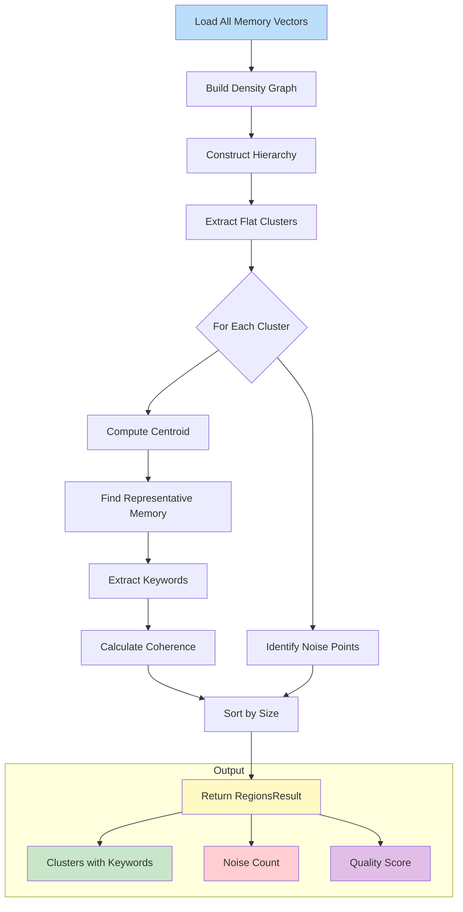

### K-Means vs HDBSCAN

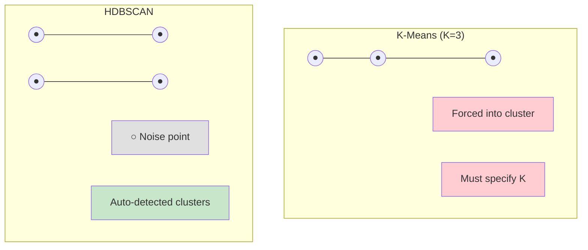

---

## UMAP Projection

### What It Is

UMAP (Uniform Manifold Approximation and Projection) is a dimensionality reduction technique that projects high-dimensional embeddings into 2D or 3D for visualization while preserving both local and global structure.

### Why UMAP Over t-SNE

| Feature | t-SNE | UMAP |
|---------|-------|------|
| Speed | Slower | Faster |
| Global structure | Poor | Better preserved |
| Scalability | Limited | Handles larger datasets |
| Reproducibility | Random each run | Deterministic with seed |

### Implementation

From `spatial_memory/services/spatial.py`:

```python
def visualize(self, memory_ids: list[str] | None = None,
              dimensions: Literal[2, 3] = 2) -> VisualizationResult:
    """Generate visualization using UMAP projection."""

    # Configure UMAP
    reducer = umap.UMAP(
        n_components=dimensions,
        n_neighbors=min(15, len(vectors) - 1),
        min_dist=0.1,
        metric="cosine",  # Natural for embeddings
        random_state=42,  # Reproducibility
    )
    embedding = reducer.fit_transform(vectors)
```

### Configuration Parameters

| Parameter | Default | Effect |
|-----------|---------|--------|
| `n_neighbors` | 15 | Larger values = more global structure |
| `min_dist` | 0.1 | Smaller values = tighter clusters |
| `metric` | cosine | Natural for embedding similarity |

### Use Case: The `visualize` Tool

Generates visualizations in multiple formats:
- **JSON**: Node/edge data for custom rendering
- **Mermaid**: Graph diagrams for documentation
- **SVG**: Standalone visual with color-coded clusters

### UMAP Visualization Pipeline

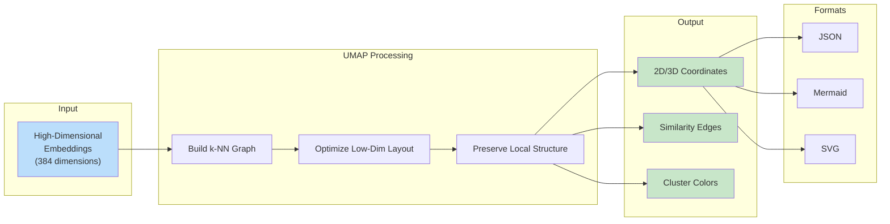

### Dimensionality Reduction Concept

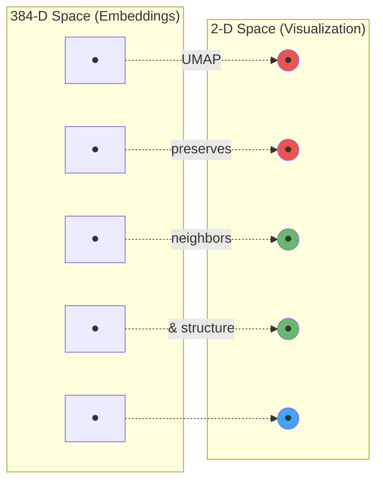

---

## ONNX Runtime Optimization

### What It Is

ONNX (Open Neural Network Exchange) Runtime is an inference engine that provides optimized execution of neural networks. Spatial Memory MCP uses it for embedding generation.

### Performance Benefits

| Metric | PyTorch | ONNX Runtime |
|--------|---------|--------------|
| Inference speed | Baseline | 2-3x faster |
| Memory usage | Higher | ~60% less |
| GPU requirement | Optional | CPU-optimized |

### Implementation

From `spatial_memory/core/embeddings.py`:

```python
def _detect_backend(requested: EmbeddingBackend) -> Literal["onnx", "pytorch"]:
    """Detect which backend to use."""
    if requested == "auto":
        if _is_onnx_available():
            return "onnx"
        return "pytorch"
    # ...

def _load_local_model(self) -> None:
    """Load model with appropriate backend."""
    self._active_backend = _detect_backend(self._requested_backend)

    if self._active_backend == "onnx":
        self._model = SentenceTransformer(
            self.model_name,
            backend="onnx",
        )
        logger.info("Using ONNX Runtime backend (2-3x faster inference)")
```

### Automatic Detection

The system automatically detects ONNX availability:

```python
def _is_onnx_available() -> bool:
    """Check if ONNX Runtime and Optimum are available."""
    try:
        import onnxruntime
        import optimum.onnxruntime
        return True
    except ImportError:
        return False
```

### Installation

To enable ONNX Runtime:

```bash
pip install sentence-transformers[onnx]
```

### Backend Selection Flow

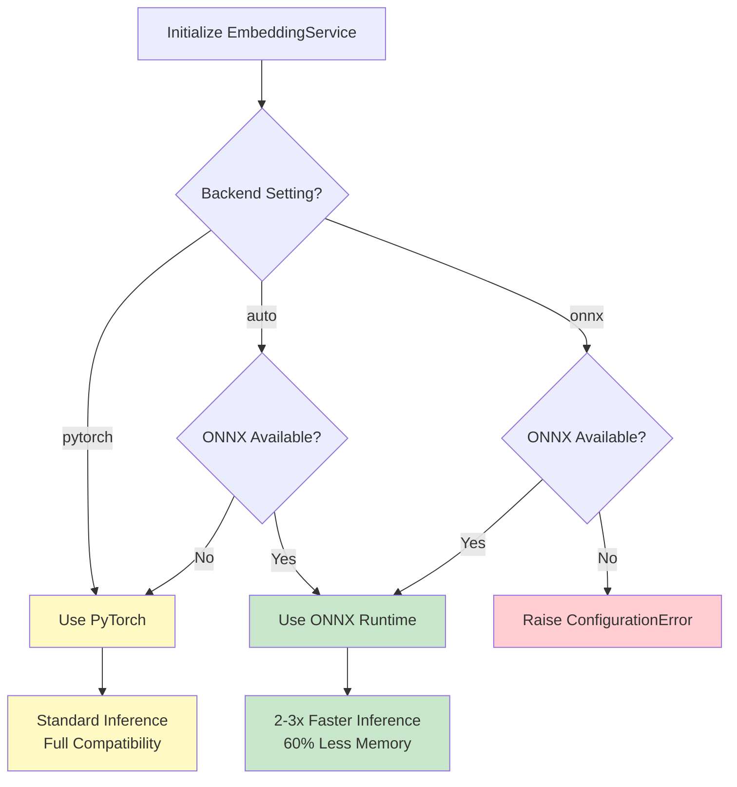

### Embedding Generation Pipeline

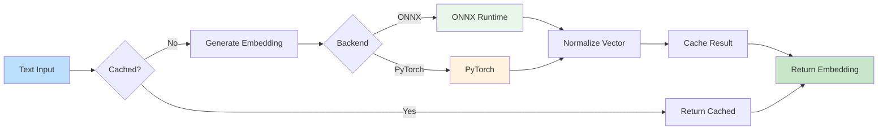

---

## scipy Integration

### What It Is

scipy is a fundamental library for scientific computing in Python. Spatial Memory MCP uses it specifically for efficient similarity calculations.

### Why scipy

The primary use is `scipy.spatial.distance.cdist` for computing pairwise distances:

```python
from scipy.spatial.distance import cdist

# Vectorized pairwise cosine similarity
distances = cdist(normalized_vectors, normalized_vectors, metric="cosine")
similarities = 1.0 - distances
```

### Performance Comparison

| Method | Operation | Performance |
|--------|-----------|-------------|
| Naive loops | N² iterations | Slow |
| NumPy dot product | Matrix multiplication | Good |
| scipy.cdist | Optimized C implementation | Best |

### Implementation

From `spatial_memory/services/spatial.py`:

```python
def _compute_pairwise_similarities(self, vectors: np.ndarray) -> np.ndarray:
    """Compute pairwise cosine similarities using vectorized operations."""

    # Normalize vectors
    norms = np.linalg.norm(vectors, axis=1, keepdims=True)
    normalized = vectors / np.where(norms < 1e-10, 1.0, norms)

    if SCIPY_AVAILABLE:
        # scipy.cdist with cosine metric (returns distances)
        distances = cdist(normalized, normalized, metric="cosine")
        similarities = 1.0 - distances
    else:
        # Fallback: numpy dot product
        similarities = normalized @ normalized.T

    return similarities
```

### Graceful Degradation

scipy is an optional dependency. If not available, the system falls back to NumPy matrix operations:

```python
try:
    from scipy.spatial.distance import cdist
    SCIPY_AVAILABLE = True
except ImportError:
    SCIPY_AVAILABLE = False
    logger.debug("scipy not available - using fallback for similarity calculations")
```

### Where scipy Is Used

1. **Visualization edges**: Computing similarity edges between all node pairs
2. **Clustering quality**: Silhouette score calculation (via sklearn, which uses scipy)
3. **Batch similarity**: Efficient pairwise comparisons in consolidation

### Pairwise Similarity Computation

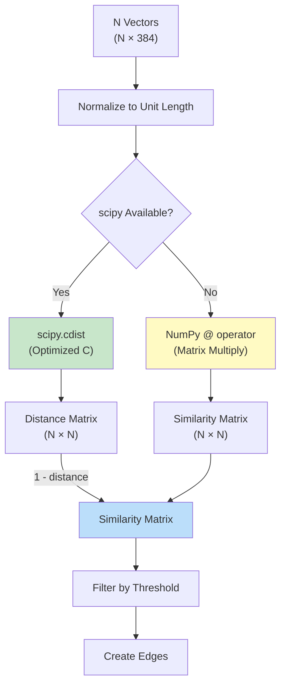

### Performance Scaling

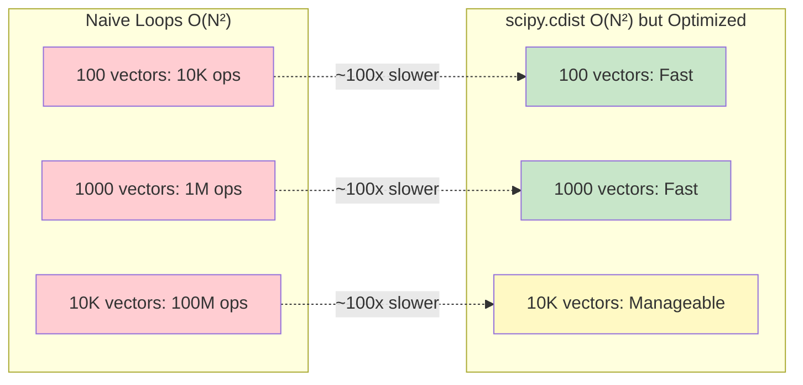

---

## References

### Memory Research

1. **Ebbinghaus, H. (1885)**. *Memory: A Contribution to Experimental Psychology*. The foundational research on the forgetting curve. [Read](https://psychclassics.yorku.ca/Ebbinghaus/index.htm)

2. **Settles, B. & Meeder, B. (2016)**. *A Trainable Spaced Repetition Model for Language Learning*. Duolingo's half-life regression algorithm. [ACL Anthology](https://aclanthology.org/P16-1174/)

3. **FSRS Algorithm**. Free Spaced Repetition Scheduler. [GitHub](https://github.com/open-spaced-repetition/fsrs4anki)

### Algorithm References

4. **SLERP**: Shoemake, K. (1985). *Animating rotation with quaternion curves*. SIGGRAPH '85.

5. **HDBSCAN**: Campello, R.J.G.B., Moulavi, D., Sander, J. (2013). *Density-Based Clustering Based on Hierarchical Density Estimates*. [Paper](https://link.springer.com/chapter/10.1007/978-3-642-37456-2_14)

6. **UMAP**: McInnes, L., Healy, J., Melville, J. (2018). *UMAP: Uniform Manifold Approximation and Projection for Dimension Reduction*. [arXiv](https://arxiv.org/abs/1802.03426)

### Libraries

- [ONNX Runtime](https://onnxruntime.ai/)
- [sentence-transformers](https://www.sbert.net/)
- [LanceDB](https://lancedb.github.io/lancedb/)
- [hdbscan](https://hdbscan.readthedocs.io/)
- [umap-learn](https://umap-learn.readthedocs.io/)
- [scipy](https://scipy.org/)
